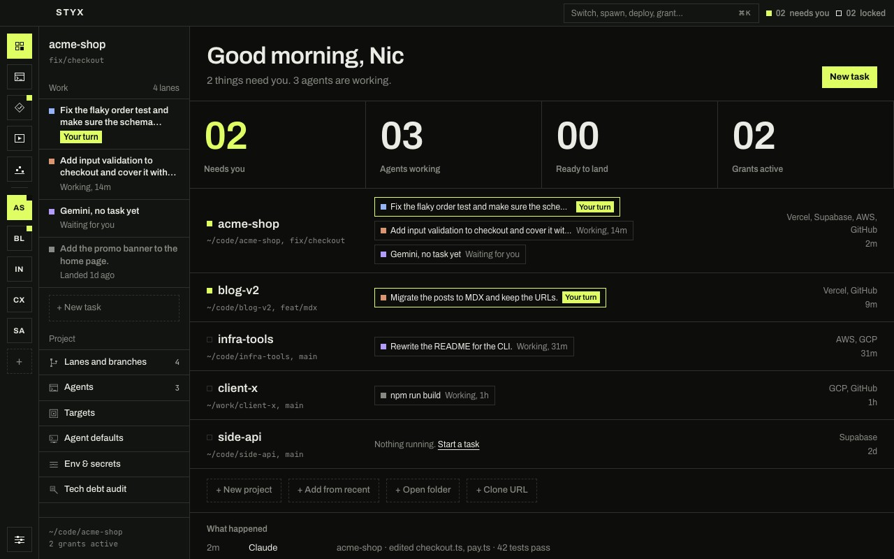
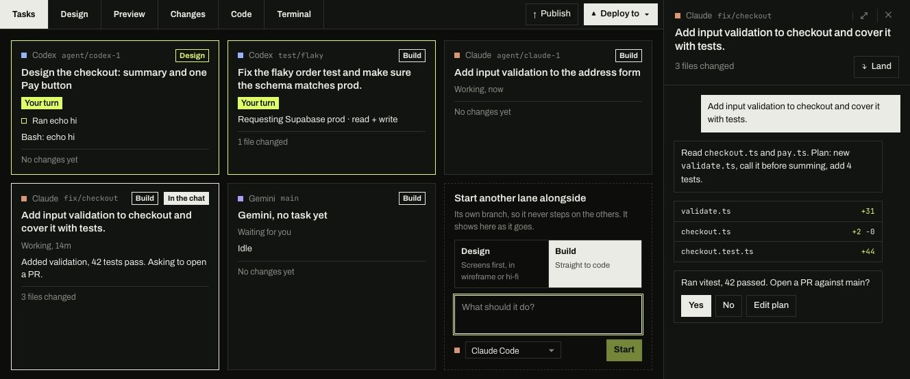
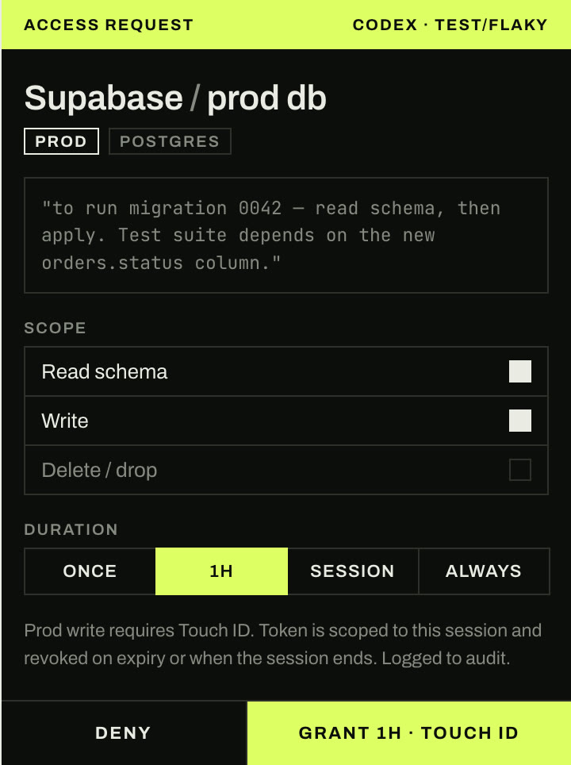
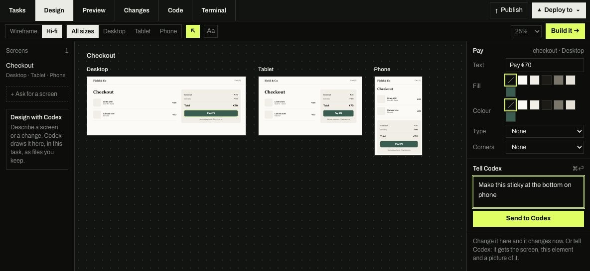
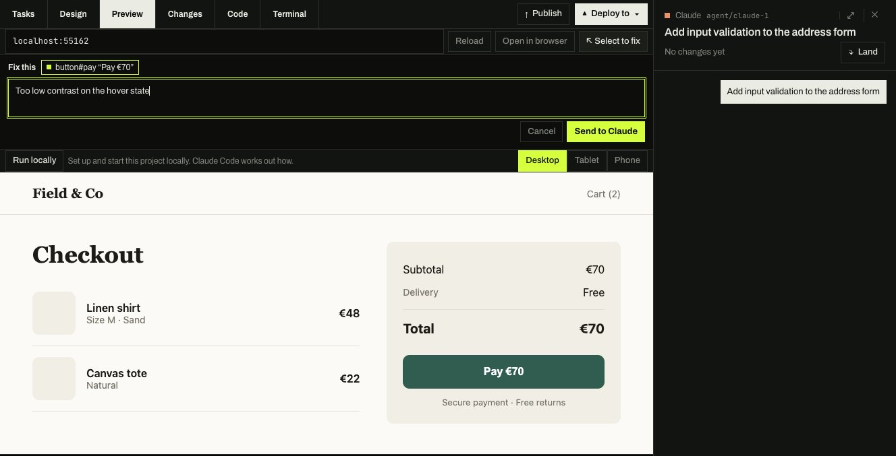

<div align="center">


<h1>Styx</h1>

**Run Claude Code, Codex, Gemini and Cursor on all your projects at once.<br />They ask before they touch production.**

[**Download for Mac**](https://heystyx.com/download/mac?from=github) &nbsp;·&nbsp; [**Download for Windows**](https://heystyx.com/download/win?from=github) &nbsp;·&nbsp; [**Linux**](https://github.com/NicholasFlemmer/styx-app/releases/latest) &nbsp;·&nbsp; [Website](https://heystyx.com) &nbsp;·&nbsp; [Watch the story (1:42)](https://heystyx.com/story)

**Contribute:** [Add an agent](docs/contributing/adding-an-agent.md) &nbsp;·&nbsp; [Add a deploy target](docs/contributing/adding-a-target.md) &nbsp;·&nbsp; [Contributing guide](CONTRIBUTING.md)

[](https://github.com/NicholasFlemmer/styx-app/actions/workflows/ci.yml)
[](LICENSE)


<br />


</div>

<br />

You already use coding agents. The hard part is everything around them: one agent per terminal, each on whatever
branch it found, your deploy keys sitting in a `.env` they can all read, and no idea which one is waiting on you.

Styx is one window for all of it. Every project you work on, every agent working in them, and every login they need
to ship. Each task gets its own branch, so agents never trip over each other. And when one wants to deploy, migrate a
database or touch anything live, it has to ask you first.

## Get started

1. **[Download Styx](https://heystyx.com)** for Mac (Apple Silicon), Windows or Linux (both beta). It's free.
2. **Add a project.** Styx finds the repos you already have, along with your editor's recent projects.
3. **Start a task.** Say what you want and pick the agent. It works on its own branch, and you land the result on
   main when you're happy.

Styx drives the agent CLIs you already have and are signed in to (Claude Code, Codex, Gemini CLI or Cursor), so your
existing subscriptions just work. There are no API keys to paste, and your prompts go straight to the agent, not
through us.

## What it does

### All your projects, one window



Styx is built around switching between everything you work on, not one repository. Each project keeps its own tasks,
agents, terminal and logins, and they're all one click or one keystroke apart. Home shows every project at once: what
needs you, what's working and what's ready to land.

### Many tasks, side by side



Every task runs in its own copy of the repo on its own branch. Tasks shows them all at once: what each is doing,
what it changed, and which ones are waiting on you. When one is done, **Land** commits it, brings main in, runs your
checks and merges it. If a turn went wrong, **Undo this turn** puts the files back the way they were.

### Agents ask before production



Connect Vercel, AWS, Google Cloud, Supabase, GitHub and SSH once. From then on an agent can't just use them: it asks,
says why, and you choose what it gets and for how long (once, an hour, or the session).

- **Scoped and short-lived.** Agents get a token or an SSH agent socket for that grant only, and it's revoked when
  the grant ends. They never see your keys.
- **Production needs you physically there.** Deploys, writes and deletes on production ask for Touch ID, Windows
  Hello, or on Linux your system password.
- **Your keys stay in your keychain.** Never in the project, the database, the logs or the agent's environment.
- **Everything is written down.** Every request, approval, use and revoke goes into an audit log that can't be
  edited after the fact.

<br clear="right" />

### Design it before you build it



Ask an agent for screens and they appear on a canvas at desktop, tablet and phone sizes. Click anything to change it
yourself or tell the agent what to fix. When it looks right, **Build it** starts a build task with the design attached.

### Point at what's wrong



**Preview** runs your app inside Styx. Use **Select to fix**, click the thing that's off and say what's wrong: the agent
gets the element, the page and a picture of it.

## And a lot more

**Working with agents**

- **Tasks that know about each other.** Each agent hears when another task changes a file it touched, and they can
  agree who does what.
- **Talk to it mid-turn.** Codex takes a message straight away; the others hold it and send it when the turn ends.
- **Pick the model and effort per task.** Attach images and files, and use `@file` and `/command` as you type.
- **Agent dock.** An always-on-top column of every agent that needs you, across all your projects.
- **Notifications** in the Dock or system tray when an agent is waiting on you.
- **Skills.** Install instruction files for each agent, or commit them with the project.

**Reviewing and shipping**

- **Changes** shows what the agent did, turn by turn, with each diff: undo a turn, revert a single change, or ask
  for changes.
- **Merge conflicts go back to the agent** that made them, with both sides' intent; Styx checks the result before
  committing it.
- **Tasks stay current.** Main is brought in before you publish, so nothing lands on a stale base.
- **Publish** commits, pushes and opens a pull request. **Deploy to** runs your deploy under the same access rules.
- **Run locally** works out how to start your app and runs it in Preview.

**Your setup**

- **Command palette** (⌘K / Ctrl+K) to switch projects, start agents, deploy and grant from the keyboard.
- **Policies.** Auto-approve the safe things (say, GitHub reads) and set how long access lasts.
- **Usage.** Tokens, cost and turns across every agent and project.
- **Tech debt audit.** An agent reviews the repo in the background and reports what will slow the next person down.
- **Brings your editor along.** Recent projects, keybindings and theme come in, and any file opens back in your editor.
- **Env and secrets per project**, with the secrets in your keychain, not the repo.
- Light and dark themes, and it keeps itself up to date.

## Works with

- **Agents:** Claude Code · Codex · Gemini CLI · Cursor agent · any shell
- **Targets agents can ask for:** Vercel · AWS · Google Cloud · Supabase · GitHub · SSH
- **Platforms:** macOS (Apple Silicon) · Windows 10 and 11 (beta) · Linux, as an AppImage or .deb (beta)
- **Editors:** the built-in editor and terminal, or open any task in VS Code, Cursor, Zed or JetBrains

## Free, open, and private

**Is it free?** Yes. Styx is free and open source under the [Apache License 2.0](LICENSE). Every feature works without
an account. Signing in (with GitHub or Google) is optional.

**What leaves my machine?** Your code, projects, paths and prompts never do. Release builds send anonymous usage counts
(how often the app opens, a task starts, an agent fails to start and why) so we know what to fix. The complete, fixed
list is [`usageEventSchema`](packages/core/src/model/usage-report.ts), with no field that could carry a name, path or
text. Turn it off in **Settings › Account › Send usage counts**. Running from source (`pnpm dev`) never sends anything;
a build you package yourself does, unless you point it at your own service (see [CONTRIBUTING.md](CONTRIBUTING.md)).

**Is it a sandbox?** No, and we'd rather say so. Styx is a guardrail: agents run as you, on your machine, and an agent
that deliberately goes around Styx's tools isn't stopped by them. What Styx guarantees is that it never hands an agent
your keys, and that every grant it gives is scoped, timed and written down.

**How does an agent ask?** Agents talk to Styx through a local broker (`styx mcp`) and small wrappers around the
`gh`, `vercel`, `aws`, `gcloud`, `supabase` and `ssh` commands. A request shows up in the chat, on the task and as a
notification, and approving it anywhere resolves it everywhere. The design decisions behind this are in
[`docs/adr`](docs/adr).

<details>
<summary><b>Build from source</b></summary>

<br />

You need Node 22 or newer, pnpm 10 (`corepack enable` picks the right version) and git. On macOS, the Xcode command line
tools; on Windows, the Visual Studio C++ build tools; on Linux, `build-essential` and `python3` (for the native
modules). Running the end-to-end tests on a headless Linux machine needs `xvfb-run`.

```sh
pnpm install
pnpm tokens:build
pnpm dev                       # STYX_FIXTURE=demo seeds sample projects in a temporary database
```

Checks and packaging:

```sh
pnpm typecheck && pnpm lint && pnpm test
pnpm e2e                       # Playwright, driving the Electron app
pnpm storybook                 # the component library
pnpm package:mac               # or package:win
```

The code is a pnpm monorepo:

| Path              | What                                                                                                            |
| ----------------- | --------------------------------------------------------------------------------------------------------------- |
| `apps/desktop`    | The Electron app: `src/main` (database, git, terminals, keychain, the access broker) and `src/renderer` (React) |
| `apps/website`    | [heystyx.com](https://heystyx.com)                                                                              |
| `packages/core`   | Domain types, state machines, the policy engine and the IPC contract. No Electron, DOM or I/O                   |
| `packages/ui`     | The component library, with Storybook                                                                           |
| `packages/broker` | The protocol agents use to ask for access, and `styx mcp`                                                       |
| `packages/cli`    | The `styx` command line and the provider wrappers                                                               |

If Electron starts as plain Node, your shell has `ELECTRON_RUN_AS_NODE` set; the scripts above already clear it.

</details>

## Contributing

Bug reports, ideas and pull requests are welcome. Start with [CONTRIBUTING.md](CONTRIBUTING.md). To report a security
problem, please follow [SECURITY.md](SECURITY.md) instead of opening an issue.

The two easiest ways in are self-contained, with a worked example and a checklist each:

- **[Add an agent](docs/contributing/adding-an-agent.md):** support another coding agent CLI (OpenCode, Aider, Goose,
  Amp, …).
- **[Add a deploy target](docs/contributing/adding-a-target.md):** let agents ask for another platform (Netlify,
  Cloudflare, Fly.io, Railway, Render, Azure, …).

## License

Apache License 2.0. See [LICENSE](LICENSE). The Styx name and logo aren't covered by the licence, so if you ship a fork,
give it its own name.
