# State machines

Source of truth: `packages/core/src/machines/session.ts` and `machines/grant.ts` (exhaustive object-literal
tables; every (state, event) pair is tested, invalid pairs return `null`). Effects are data executed by main;
time is injected via `ctx.now`.

## Session

Events: `start · ask · ask-resolved · finish · error(reason) · resolve · activity · quiet`.

```mermaid
stateDiagram-v2
  [*] --> idle
  idle --> working: start | activity
  idle --> needs-you: ask
  working --> needs-you: ask (notify when notifyWhenNeedsMe)
  working --> idle: quiet (3 s silence)
  working --> working: activity
  needs-you --> needs-you: ask (queued "+n"), activity, quiet — never times out
  needs-you --> working: ask-resolved (no open asks)
  needs-you --> needs-you: ask-resolved (asks still open → promote next head, re-notify)
  idle --> done: finish
  working --> done: finish
  needs-you --> done: finish (cancel open asks, revoke session grants)
  paused --> done: finish
  idle --> paused: error(cli-missing | conflict | auth-expired)
  working --> paused: error
  needs-you --> paused: error
  paused --> paused: error (reason updated), ask-resolved (answered from inbox; stays paused)
  paused --> working: resolve (no open asks; banner cleared)
  paused --> needs-you: resolve (asks still open)
  done --> [*]: archived after 7 days (RetentionJob, `shouldArchive`)
```

Invalid (→ `null`): `start` from any state but idle; `ask-resolved` from idle/working; `resolve` unless paused;
`ask`, `activity`, `quiet` while paused; everything from done.

## Grant

Events: `issue · deny · cancel · use · revoke · expire`. MFA predicate: `env = prod ∧ scope ∋ write|deploy|delete`;
`issue` without `mfaVerified` is invalid when the predicate holds.

```mermaid
stateDiagram-v2
  [*] --> requested
  requested --> active: issue — policy | target policy `always` | persistent grant | user (+MFA when prod ∧ write/deploy/delete)
  requested --> denied: deny (user; agent adapts, no Styx copy)
  requested --> revoked: cancel (session end | target removed)
  active --> active: use — audit `used` with the triggering command, idle timer re-armed
  active --> revoked: use when duration = once (once-used)
  active --> revoked: revoke (user | session-end | target-removed | policy)
  active --> expired: expire (expiresAt | idle) — never for `always`
  denied --> [*]
  revoked --> [*]
  expired --> [*]
```



Durations: `once` and `1h` expire 1 h after issue (`once` is also revoked after its first use); `session` has no
hard expiry and ends with the session; `always` never expires, is detached from the session (`sessionId = null`),
is listed as persistent and is revocable from any lock glyph. Idle expiry comes from the policy engine
(`idle-expiry` rule, default 1 h) and applies to every duration except `always`.

Every transition out of `requested`/`active` appends an audit row (`granted · denied · used · revoked · expired`)
and, where a session exists, notifies it; `issue`/`deny`/`cancel` resolve the pending ask so the session machine
receives `ask-resolved`.
