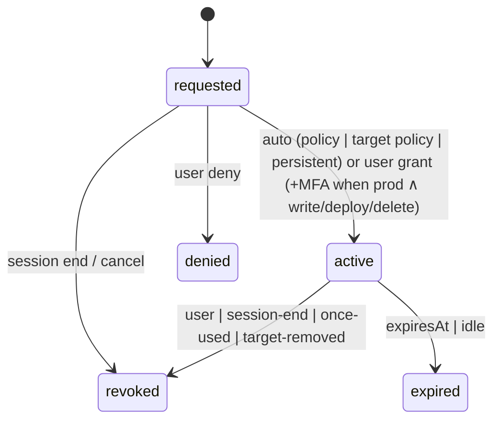

# State machines

## Session

```mermaid
stateDiagram-v2
  [*] --> idle
  idle --> working: start
  working --> needs-you: ask
  needs-you --> working: ask-resolved (no open asks)
  working --> done: finish
  working --> paused: error(cli-missing | conflict | auth-expired)
  needs-you --> paused: error
  paused --> working: resolve
  done --> [*]: archived after 7 days
```

## Grant


